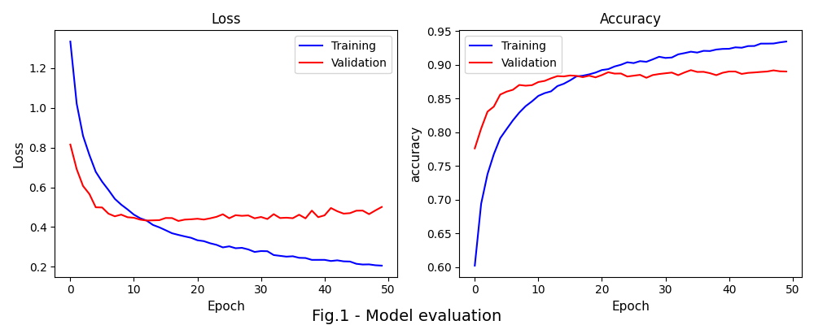
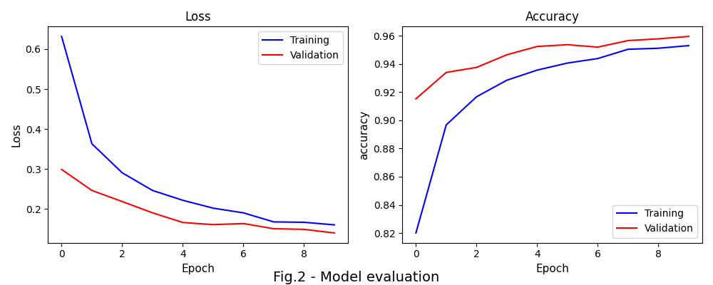
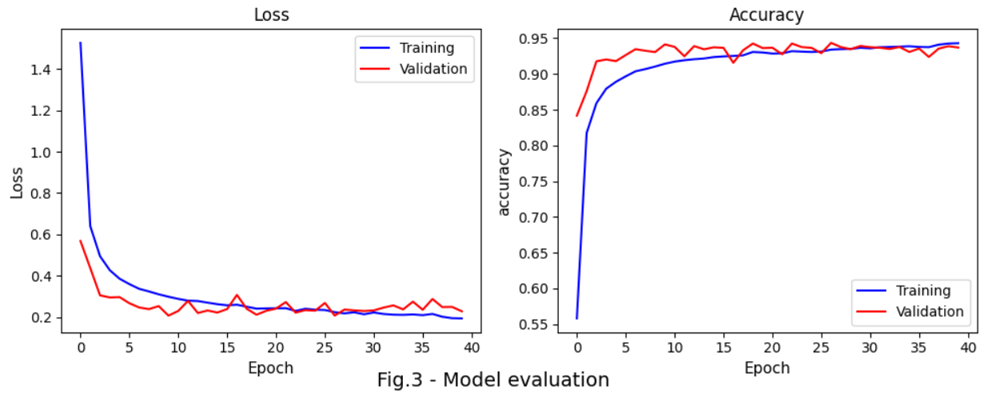

# Speech_classification

[1. Summary](README.md#Summary)   
[2. Data and methods](README.md#Data-and-methods)   
[3. Results](README.md#Results)   
[4. Installation](README.md#Installation)    
[5. Project structure](README.md#Project-structure)

## Summary
It was developed a deep learning algorythm of speech classification.

## Introduction
Voice analysis, a modern machine learning task, has been actively studied over the past two decades. As a result, several prominent technology-driven companies integrate voice assistant systems into various devices, such as smart speakers, smartphones and applications such as web mapping. For example, Apple introduced Siri in 2011, Amazon launched its cloud-based Alexa service in 2013, Yandex introduced Alice in 2017, and  Google released Assistant in 2018. These systems can recognize human speech almost instantly. The primary purpose of this technology is to assist people with routine tasks, such as managing smart home devices (e.g., turning lights on and off, adjusting the heating temperature), shopping online, playing the news, and ordering a taxi.

Despite the fact that the voice-to-text problem has been largely solved, multiple related challenges remain. For example, recognizing different accents, filtering noise efficiently, and improving real-time processing are still areas of ongoing research. Google Assistant supports approximately 40 languages, whereas Yandex Alice is available only in Russian. This highlights gaps that still need to be addressed.

This project focuses on one of the fundamental tasks of audio analysis: recognizing 11 distinct spoken commands while distinguishing them from other words and background noise. The task is based on two sources: the [Simple audio recognition: Recognizing keywords](https://www.tensorflow.org/tutorials/audio/simple_audio#import_the_mini_speech_commands_dataset) tutorial from TensorFlow and the [TensorFlow Speech Recognition Challenge](https://www.kaggle.com/competitions/tensorflow-speech-recognition-challenge/overview), which was hosted by Google Brain on the Kaggle platform in early 2018.

## Data and methods

The Speech Commands Dataset was collected through crowdsourcing. Participants were asked to pronounce single-word commands from the following list: `Yes`, `No`, `Up`, `Down`, `Left`, `Right`, `On`, `Off`, `Stop`, and `Go`. To help differentiate unrecognized words, additional auxiliary words such as *Zero, One, Two, Three, Four, Five, Six, Seven, Eight, Nine, Bed, Bird, Cat, Dog, Happy, House, Marvin, Sheila, Tree, and Wow* were included. Background noise samples were also added. Words from the auxiliary group must be labeled as `unknown`, while background noise must be labeled as `silence`.

The dataset consists of two uneven parts: training and *main test*. The training set contains approximately 65,000 one-second-long .wav files, each stored in a folder named after the corresponding command. In contrast, the *main test* sample is more than twice as large, containing over 150,000 files. Unlike the training set, all test files are stored in a single folder and follow a naming convention such as clip_000044442.wav, meaning their labels cannot be inferred from either the filename or the folder structure.

The main goal of this assignment was to create a simple speech detector that capable of understanding basic spoken commands using open-source tools. The model's algorithm is expected to predict the correct labels for test sample files, though not all files will contribute to the final leaderboard score.

The dataset was loaded using the `audio_dataset_from_directory` method from Keras. This function generates two batched subsets: training (80%) and validation (20%). Additionally, it trims all audio files to a specified duration. The output format is `[batch_size, sequence_length, num_channels]`. Since all audio files contain a single channel (num_channels=1), this redundant axis was removed using the `tf.squeeze` method. To improve model training, the validation dataset was further split into two subsets: validation and test. Each subset consists of wave signals, as shown fig.1.

  

Here is an instance of 'on' command:

 
<video controls="" autoplay="" name="media" height="100">
    <source src="data_example\00b01445_nohash_0.wav" type="audio/mp3" >
</video>

The waveforms in the dataset are represented in the time domain. Next, they were converted from the time-domain signals into the time-*frequency*-domain signals ([or spectrograms](https://en.wikipedia.org/wiki/Spectrogram)) by computing the [short-time Fourier transform (STFT)](https://en.wikipedia.org/wiki/Short-time_Fourier_transform). 

The Short-Time Fourier Transform (STFT) is a technique used to analyze the frequency content of a non-stationary signal over time. It works by dividing the signal into small, overlapping segments (windows) and computing the Fourier Transform for each segment separately. This results in a time-frequency representation, where each point in the spectrogram indicates the presence and intensity of specific frequencies at a given time. The choice of window size affects the trade-off between time and frequency resolution. The method returns a 2D tensor.

  

## Results

After 40 epochs of training, the model reached loss of 0.93 and accuracy 0.74. These metrics reflects a score of 0.712 on the leaderboard.

  

## Installation

## Project structure

